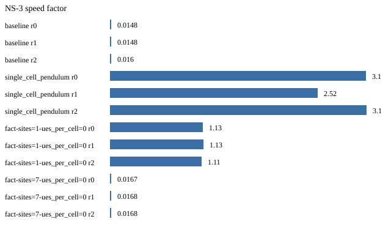
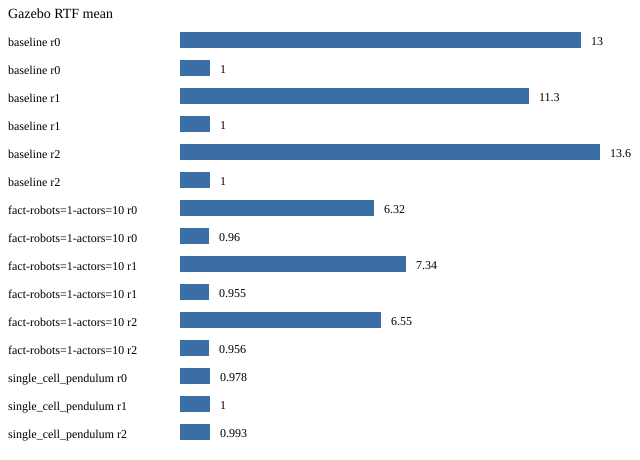

# Co-simulation benchmark summary

Thresholds: speed_margin=1.5, lag_budget_ms=1.0, rtf_min=0.95.

Rows: 72.

## Classification

- `single_cell_pendulum`: **ns3-limited** (no-TAP) — reduce NS-3 load or revive lockstep

## Plots

